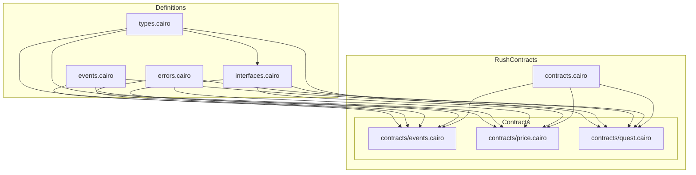

# Rush Contracts Feature Documentation

## Overview

The **Rush** suite provides three on-chain game contracts—**Events**, **Price Prediction**, and **Quests**—backed by shared types, interfaces, error codes, and event definitions. Each contract manages its own storage, emits structured events, and enforces access control and business rules via common interfaces and error constants. Together, they enable users to participate in prediction markets, price prediction rounds, and stake‐based quests using a standardized ERC-20 dispatch mechanism.

## Architecture Overview



## Component Structure

### 1. Root Module

#### **contracts.cairo** (`src/contracts.cairo`)
- **Purpose:** Aggregates the three game contracts under one namespace.
- **Contents:**
  ```cairo
  pub mod events;
  pub mod price;
  pub mod quest;
  ``` 

---

### 2. Event Prediction Contract

#### **RushEvents** (`src/contracts/events.cairo`)
- **Purpose:** Manages creation, lifecycle, betting, resolution, and reward claims for binary or multi-option prediction events.
- **Dependencies:**  
  - Interfaces: `IRushEvents`, `IRushERC20Dispatcher`, `IRushERC20DispatcherTrait`  
  - Types: `Config`, `PredictionEvent`, `Bet`, `EventResult`  
  - Events: `EventAdded`, `EventStarted`, `EventEnded`, `EventResolved`, `EventArchived`, `BetPlaced`, `RewardClaimed`  
  - Errors: `Errors`  
  - StarkNet APIs: storage maps, `get_block_timestamp`, `get_caller_address` 

#### Storage Layout

| Field                     | Type                               | Description                              |
|---------------------------|------------------------------------|------------------------------------------|
| `config`                  | `Config`                           | Global settings (admin, fee, token, id)  |
| `event`                   | `Map<u64, PredictionEvent>`        | Event details by ID                      |
| `event_participant`       | `Map<(u64, u64), ContractAddress>` | Participant addresses per event/index    |
| `event_participants_count`| `Map<u64, u64>`                    | Count of participants per event          |
| `event_participant_exists`| `Map<(u64, ContractAddress), bool>`| Duplicate-bet prevention                 |
| `user_bet`                | `Map<(ContractAddress, u64), Bet>` | User’s bet per event                     |
| `user_event_count`        | `Map<ContractAddress, u64>`        | Number of events a user participated in  |
| `user_events`             | `Map<(ContractAddress, u64), u64>` | Event IDs by user/index                  |

#### Events Emitted

- **Lifecycle:** `EventAdded`, `EventStarted`, `EventEnded`, `EventResolved`, `EventArchived`  
- **Betting:** `BetPlaced`, `RewardClaimed` 

#### Constructor

```cairo
#[constructor]
fn constructor(
    ref self: ContractState,
    admin: ContractAddress,
    treasury_fee: u256,
    treasury_address: ContractAddress,
    token: ContractAddress
) {
    self.config.admin.write(admin);
    self.config.treasury_fee.write(treasury_fee);
    self.config.treasury_address.write(treasury_address);
    self.config.token.write(token);
    self.config.id.write(1);
}
```

#### Public ABI Methods

| Method                | Signature                                                                                                                                  | Returns | Description                                       |
|-----------------------|--------------------------------------------------------------------------------------------------------------------------------------------|---------|---------------------------------------------------|
| `add_event`           | `(name: ByteArray, category: ByteArray, binary: bool, home_team: ByteArray, away_team: ByteArray, start_time: u64, end_time: u64, options…)` | `u64`   | Creates a new event; only admin                  |
| `start_event`         | `(event_id: u64)`                                                                                                                           | `bool`  | Marks event as started; only admin                |
| `end_event`           | `(event_id: u64)`                                                                                                                           | `bool`  | Marks event as ended; only admin                  |
| `resolve_event`       | `(event_id: u64, result: EventResult)`                                                                                                      | `bool`  | Resolves bets, calculates rewards; only admin     |
| `archive_event`       | `(event_id: u64)`                                                                                                                           | —       | Archives completed event; only admin              |
| `place_bet`           | `(amount: u256, event_id: u64, pick: EventResult)`                                                                                          | —       | User places a bet                                  |
| `claim_reward`        | `(event_id: u64)`                                                                                                                           | —       | User claims winnings                               |
| **Queries**           |                                                                                                                                             |         |                                                   |
| `get_event`           | `(event_id: u64)`                                                                                                                           | `PredictionEvent` | Fetch event details                   |
| `get_event_count`     | `()`                                                                                                                                         | `u64`   | Total events created                              |
| `get_user_bet`        | `(user: ContractAddress, event_id: u64)`                                                                                                    | `Bet`   | Fetch a specific user bet                         |
| `get_user_bet_count`  | `(user: ContractAddress)`                                                                                                                   | `u64`   | Number of bets by user                            |
| `get_user_event_by_index` | `(user: ContractAddress, index: u64)`                                                                                                | `u64`   | Event ID at user’s participation index            | 

#### Internal Helpers

- `_is_admin`: ensures caller equals `config.admin`  
- `_event_exists`: checks event presence  
- `_add_event_participant`: registers new participant  
- `_get_participants`: retrieves participant list  
- `_is_bettable`: enforces timing and duplicate rules  
- `_is_claimable`: enforces win and unclaimed conditions 

---

### 3. Price Prediction Contract

#### **RushPrice** (`src/contracts/price.cairo`)
- **Purpose:** Offers bull/bear price prediction rounds with betting, locking, execution, and leaderboards.  
- **Dependencies:** `IRushPrice`, ERC-20 dispatcher interfaces, `Errors`, `PricePrediction`, `PriceBet`, `Config`, `Direction`, `RoundResult`, `Leaderboard`, round events 

#### Storage Layout

| Field                       | Type                                 | Description                                  |
|-----------------------------|--------------------------------------|----------------------------------------------|
| `config`                    | `Config`                             | Global settings                              |
| `round`                     | `Map<u64, PricePrediction>`          | Round details by ID                          |
| `round_participant`         | `Map<(u64, u64), ContractAddress>`   | Participant addresses per round/index        |
| `round_participant_count`   | `Map<u64, u64>`                      | Count of participants per round              |
| `round_participant_exists`  | `Map<(u64, ContractAddress), bool>`  | Duplicate-bet prevention                     |
| `user_bet`                  | `Map<(ContractAddress, u64), PriceBet>` | User’s bet per round                       |
| `user_round_count`          | `Map<ContractAddress, u64>`          | Rounds a user joined                         |
| `user_rounds`               | `Map<(ContractAddress, u64), u64>`   | Round IDs by user/index                      |
| `players`                   | `Map<u64, ContractAddress>`          | List of participants                         |
| `players_count`             | `u64`                                | Total registered players                     |
| `player_index`              | `Map<ContractAddress, u64>`          | Player’s position index                      |
| `leaderboard`               | `Map<ContractAddress, Leaderboard>`  | User performance summary                     |

#### Events Emitted

- `RoundStarted`, `RoundLocked`, `RoundEnded`, `RoundExecuted`  
- `BetPlaced` (alias `PriceBetPlaced`), `RewardClaimed` (alias `PriceRewardClaimed`) 

#### Constructor

```cairo
#[constructor]
fn constructor(
    ref self: ContractState,
    admin: ContractAddress,
    treasury_fee: u256,
    treasury_address: ContractAddress,
    token: ContractAddress
) {
    self.config.admin.write(admin);
    self.config.treasury_fee.write(treasury_fee);
    self.config.treasury_address.write(treasury_address);
    self.config.token.write(token);
    self.config.id.write(1);
}
```

#### Public ABI Methods

| Method                  | Signature                                                                                      | Returns            | Description                      |
|-------------------------|------------------------------------------------------------------------------------------------|--------------------|----------------------------------|
| `place_bet`             | `(round_id: u64, direction: Direction, amount: u256)`                                          | —                  | User places bull/bear bet        |
| `claim_reward`          | `(round_id: u64)`                                                                              | —                  | User claims winnings             |
| `execute_round`         | `(price: u128)`                                                                                | —                  | Locks and settles round; admin   |
| **Queries**             |                                                                                                |                    |                                  |
| `get_round`             | `(round_id: u64)`                                                                              | `PricePrediction`  | Fetch round details              |
| `get_config`            | `()`                                                                                           | `Config`           | Global settings                  |
| `get_next_round`        | `()`                                                                                           | `PricePrediction`  | Upcoming round                   |
| `get_live_round`        | `()`                                                                                           | `PricePrediction`  | Currently active round           |
| `get_ended_round`       | `()`                                                                                           | `PricePrediction`  | Most recently ended round        |
| `get_user_bet`          | `(user: ContractAddress, round_id: u64)`                                                       | `PriceBet`         | Specific user’s bet              |
| `get_user_round_by_index` | `(user: ContractAddress, index: u64)`                                                       | `u64`              | Round ID by user index           |
| `get_leaderboard`       | `(user: ContractAddress)`                                                                      | `Leaderboard`      | User’s performance stats         |
| `get_players_count`     | `()`                                                                                           | `u64`              | Total registered players         |
| `get_player_by_index`   | `(index: u64)`                                                                                 | `ContractAddress`  | Player address at index          | 

#### Internal Helpers

- `_is_owner`: admin check  
- `_round_exists`: round presence  
- `_is_bettable`: timing and duplicate checks  
- `_is_claimable`: win and unclaimed checks  
- `_add_round_participant`, `_get_participants`, `_lock_round`, `_end_round`, `_execute_round` 

---

### 4. Quest Contract

#### **RushQuest** (`src/contracts/quest.cairo`)
- **Purpose:** Hosts stake-based challenges (“quests”), tracking creation, participation, and reward claims.  
- **Dependencies:** `IRushQuest`, ERC-20 dispatcher interfaces, `Errors`, `Config`, `Quest`, `UserGame`, quest events 

#### Storage Layout

| Field                  | Type                                 | Description                         |
|------------------------|--------------------------------------|-------------------------------------|
| `config`               | `Config`                             | Global settings                     |
| `quests`               | `Map<u64, Quest>`                    | Quest details by ID                 |
| `user_quests`          | `Map<(ContractAddress, u64), Quest>` | User’s quest snapshots              |
| `user_quests_count`    | `Map<ContractAddress, u64>`          | Quests created/joined by user       |
| `user_quests_id`       | `Map<(ContractAddress, u64), u64>`   | Quest IDs by user/index             |
| `user_game`            | `Map<(ContractAddress, u64), UserGame>` | Participation state per user/quest |

#### Events Emitted

- `QuestCreated`, `QuestStarted`, `QuestEnded`, `QuestJoined`, `QuestRewardClaimed` 

#### Constructor

```cairo
#[constructor]
fn constructor(
    ref self: ContractState,
    admin: ContractAddress,
    treasury_fee: u256,
    treasury_address: ContractAddress,
    token: ContractAddress
) {
    self.config.admin.write(admin);
    self.config.treasury_fee.write(treasury_fee);
    self.config.treasury_address.write(treasury_address);
    self.config.token.write(token);
}
```

#### Public ABI Methods

| Method                | Signature                                                   | Returns | Description                      |
|-----------------------|-------------------------------------------------------------|---------|----------------------------------|
| `create_quest`        | `(name: ByteArray, entry_fee: u256, stake: u256)`           | —       | Creates a new quest              |
| `start_quest`         | `(quest_id: u64)`                                           | —       | Marks quest as started           |
| `end_quest`           | `(quest_id: u64)`                                           | —       | Marks quest as ended             |
| `join_quest`          | `(quest_id: u64)`                                           | —       | User joins a quest               |
| `claim_reward`        | `(quest_id: u64, amount: u256)`                             | —       | User claims quest reward         |
| **Queries**           |                                                             |         |                                  |
| `get_quest`           | `(quest_id: u64)`                                           | `Quest` | Fetch quest details              |
| `get_quest_count`     | `()`                                                        | `u64`   | Total quests created             |
| `get_user_quest`      | `(user: ContractAddress, quest_id: u64)`                    | `Quest` | User’s quest snapshot            |
| `get_user_quest_count`| `(user: ContractAddress)`                                   | `u64`   | Quests a user has joined         |
| `get_user_quest_id`   | `(user: ContractAddress, index: u64)`                       | `(u64,u64)` | (index, Quest ID)            |
| `get_user_game`       | `(user: ContractAddress, quest_id: u64)`                    | `UserGame` | Participation details         | 

#### Internal Helpers

- `_is_owner`: ensures caller matches quest creator 

---

### 5. Shared Interfaces

#### **interfaces.cairo** (`src/interfaces.cairo`)
- **Purpose:** Defines StarkNet interface traits for each contract and an ERC-20 dispatcher.
- **Interfaces:**  
  - `IRushEvents<T>`: prediction events operations and queries  
  - `IRushPrice<T>`: price rounds operations and queries  
  - `IRushQuest<T>`: quest lifecycle operations and queries  
  - `IRushERC20<T>`: ERC-20 token transfer utilities 

---

### 6. Event Definitions

#### **events.cairo** (`src/events.cairo`)
- **Purpose:** Centralizes all `starknet::Event` structs used by the three contracts.
- **PredictionEvent Events:**  
  - `EventAdded`, `EventStarted`, `EventEnded`, `EventResolved`, `EventArchived`, `BetPlaced`, `RewardClaimed`  
- **Price Prediction Events:**  
  - `RoundStarted`, `RoundLocked`, `RoundEnded`, `RoundExecuted`, `PriceBetPlaced`, `PriceRewardClaimed`  
- **Quest Events:**  
  - `QuestCreated`, `QuestStarted`, `QuestEnded`, `QuestJoined`, `QuestRewardClaimed`  

---

### 7. Error Codes

#### **errors.cairo** (`src/errors.cairo`)
- **Purpose:** Defines shared assertion error messages as Felt252 constants.
- **Key Errors:**  
  - `UNAUTHORIZED`, `NOT_ADMIN`  
  - `EVENT_NOT_FOUND`, `EVENT_ALREADY_STARTED`, `EVENT_NOT_STARTED`, `EVENT_ALREADY_ENDED`, `EVENT_ALREADY_RESOLVED`  
  - `NOT_START_TIME`, `NOT_END_TIME`, `ROUND_LOCKED`, `NOT_LOCK_TIME`, `ROUND_ENDED`  
  - `PARTICIPANTS_EXISTS`, `INVALID_AMOUNT`, `BET_ALREADY_PLACED`, `LOST_ROUND`, `ALREADY_CLAIMED`, `CANNOT_PREDICT`  

---

### 8. Shared Types

#### **types.cairo** (`src/types.cairo`)
- **Purpose:** Defines all shared data structures for configuration, game state, bets, and results.
- **Config**  
  | Property         | Type              | Description                  |
  |------------------|-------------------|------------------------------|
  | `admin`          | `ContractAddress` | Contract owner               |
  | `treasury_fee`   | `u256`            | Fee numerator                |
  | `treasury_address`| `ContractAddress`| Fee recipient                |
  | `id`             | `u64`             | Next entity identifier       |
  | `token`          | `ContractAddress` | ERC-20 token for payments     |  
  

- **EventResult** (`enum`)  
  `Home`, `Away`, `A`, `B`, `C`, `D`  

- **PredictionEvent**  
  Holds event metadata, timing flags, pools, and participation counts. 

- **PricePrediction**  
  | Property      | Type     | Description                    |
  |---------------|----------|--------------------------------|
  | `id`          | `u64`    | Round identifier               |
  | `bull_pool`   | `u256`   | Total up-bets                  |
  | `bear_pool`   | `u256`   | Total down-bets                |
  | `total_pool`  | `u256`   | Sum of both pools              |
  | `start_time`  | `u64`    | Round start timestamp          |
  | `lock_time`   | `u64`    | Lock timestamp                 |
  | `end_time`    | `u64`    | Round end timestamp            |
  | `start_price` | `u128`   | Price at start                 |
  | `lock_price`  | `u128`   | Price at lock                  |
  | `end_price`   | `u128`   | Price at end                   |
  | `started`     | `bool`   | Has round started              |
  | `locked`      | `bool`   | Is round locked                |
  | `ended`       | `bool`   | Has round ended                |
  | `executed`    | `bool`   | Resolution processed           |
  | `result`      | `Option<RoundResult>` | Outcome            |
  | `participants`| `u64`    | Betters count                  | 

- **PriceBet**, **Leaderboard**, **Quest**, **UserGame**  
  Defined to track individual bets, user standings, quest metadata, and per-user quest state. 

---

## Integration Points

- **Interfaces ↔ Contracts:** Each contract implements its corresponding `IRush*` interface.  
- **Types & Errors:** Shared via `use crate::types` and `use crate::errors`.  
- **Event Emission:** All domain events defined in `events.cairo` drive off-chain listeners.  
- **ERC-20 Dispatch:** Contracts rely on `IRushERC20` to move tokens for entry fees and rewards.

---

## Key Structs Reference

| Struct/Enum         | Location             | Responsibility                              |
|---------------------|----------------------|---------------------------------------------|
| `Config`            | `types.cairo`        | Global configuration                        |
| `PredictionEvent`   | `types.cairo`        | Event betting metadata                      |
| `PricePrediction`   | `types.cairo`        | Price round metadata                        |
| `Quest`             | `types.cairo`        | Quest metadata                              |
| `UserGame`          | `types.cairo`        | User’s quest participation state            |
| `IRushEvents`       | `interfaces.cairo`   | Events contract API                         |
| `IRushPrice`        | `interfaces.cairo`   | Price contract API                          |
| `IRushQuest`        | `interfaces.cairo`   | Quest contract API                          |
| `Errors`            | `errors.cairo`       | Shared error codes                          |
| `EventAdded`, etc.  | `events.cairo`       | On-chain event definitions                  |
| `RushEvents`        | `contracts/events.cairo` | Prediction Events implementation       |
| `RushPrice`         | `contracts/price.cairo`  | Price prediction implementation         |
| `RushQuest`         | `contracts/quest.cairo`  | Quest implementation                     |

This documentation captures each file’s purpose, core structures, and how they interlink to deliver the Rush gaming suite on StarkNet.